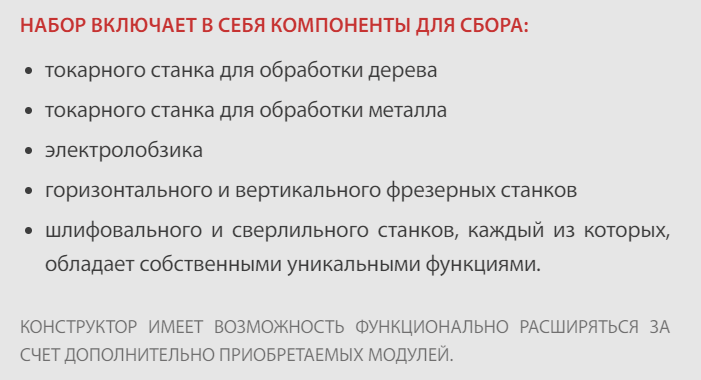
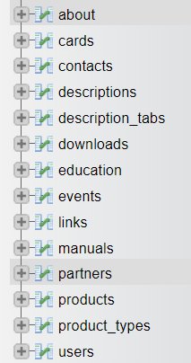

## API technolab.

#### Размещен на https://api.examen-technolab.ru/

### Эндпоинты:

#### Получение всех карточек:
- Используется метод GET.
- эндпоинт /cards
Пример: 
````
 https://api.examen-technolab.ru/cards
````
- В ответе приходит массив всех карточек в JSON.
Пример ответа:
````
[
    {
        "id": 11,
        "preview": "имя картинки",
        "lastPreview": последний индекс превьюшки,
        "title": "Заголовок товара",
        "article": "Артикул",
        "price": "Цена",
        "product": "Имя продукта и имя папки с картинками",
        "type": "тип  продукта"
    },
    {
        "id": 11,
        "preview": "aero-sport-preview.png",
        "lastPreview": 3,
        "title": "Образовательный робототехнический модуль «АЭРО». Спортивный.",
        "article": "ТА-0842",
        "price": "594 000",
        "product": "aero-sport",
        "type": "aero"
    },
]
````

#### Получение карточки по ID:
- Используется метод GET;
- эндпоинт /card?id={id-карточки}
Вместо {id-карточки} необходимо вставить соответствующее значение
Пример: 
````
 https://api.examen-technolab.ru/card?id=1 
````
- В качестве ответа приходит массив с одним объектом в JSON:
````
[
    {
        "id": 12,
        "preview": "имя картинки.формат",
        "lastPreview": последний индекс превьюшки,
        "title": "Заголовок товара",
        "article": "Артикул",
        "price": "Цена",
        "product": "Имя продукта и имя папки с картинками",
        "type": "тип  продукта"
    }
]
````
- Если карточки с таким ID нет:
````
{
    "message": "Не найдено.",
    "details": "Нет карточки с таким ID"
}
````

#### Получение подробного описания товара по ID карточки:
- Используется метод GET;
- эндпоинт /info?id={id-карточки}&id={вкладка}
Вместо {id-карточки} и {вкладка} необходимо вставить соответствующие значения. Есть вкладки 'kit' и 'specification' - состав и тех.характеристики соответственно.
Пример: 
````
 https://api.examen-technolab.ru/info?id=2&tab=kit
````
- В качестве ответа приходит массив объектов, имеющих структуру:
 ````
    {
        "title": "Заголовок раздела",
        "list": "Элементы списка, через разделитель: ','.",
        "note": "пояснение"
    }
````
- Пример отображения этого объекта на сайте:


- Пример ответа:
````
[
    {
        "title": "Набор включает в себя компоненты для сбора:",
        "list": "токарного станка для обработки дерева','токарного станка для обработки металла','электролобзика','горизонтального и вертикального фрезерных станков','шлифовального и сверлильного станков, каждый из которых, обладает собственными  уникальными функциями.",
        "note": "Конструктор имеет возможность функционально расширяться за счет  дополнительно приобретаемых модулей."
    },
    {
        "title": "Станки не могут быть собраны одновременно, поскольку используют сходные модули.",
        "list": null,
        "note": null
    }
]
````

#### Получение данных раздела "о нас":
- Используется метод GET;
- эндпоинт /about
Пример: 
````
 https://api.examen-technolab.ru/about
````
- В ответе приходит массив объектов в JSON.
Пример ответа:
````
[
    {
        "type": "тип",
        "title": "Заголовок",
        "text": "Описание",
        "children_type": null,
        "children_title": null,
        "children_text": null
    },
    {
        "type": "provider",
        "title": "‣ Надёжный поставщик",
        "text": "ООО «ЭКЗАМЕН-ТЕХНОЛАБ» предоставляет большой ассортимент современных робототехнических модулей для применения в школах в рамках программ начального и среднего образования во внеклассной работе с учащимися, а также для оснащения учебных технопарков. Наши специалисты помогут подобрать необходимые робототехнические конструкторы и сопутствующие товары.",
        "children_type": null,
        "children_title": null,
        "children_text": null
    },
]
````

#### Получение данных раздела "контакты":
- Используется метод GET;
- эндпоинт /contacts
Пример: 
````
 https://api.examen-technolab.ru/contacts
````
- В ответе приходит массив объектов в JSON.
Пример ответа:
````
[
    {
        "type": "тип",
        "title": "заголовок",
        "text": "содержание",
        "link": "ссылка",
        "linkTitle": "подсказка для ссылки"
    },
    {
        "type": "address",
        "title": "Адрес:",
        "text": "Россия, 107045, г. Москва, ул. Сретенка д.24/2, стр.1.",
        "link": "https://yandex.ru/maps/-/CCUCfDUPGC",
        "linkTitle": "Открыть карту."
    },
]
````

#### Получение данных раздела "загрузки":
- Используется метод GET;
- эндпоинт /downloads
Пример: 
````
 https://api.examen-technolab.ru/downloads
````
- В ответе приходит массив всех карточек в JSON.
Пример ответа:
````
[
    {
        "title": "Заголовок",
        "text": "Описание",
        "link": "Ссылка"
    },
    {
        "title": "VEXcode IQ",
        "text": "Программное обеспечение, необходимое для программирования наборов по робототехнике, содержащих контроллеры VEX IQ Brain первого и второго поколений.",
        "link": "https://examen-technolab.ru/downloads/software/vexcode_iq.exe"
    },
]
````

#### Получение данных раздела "обучение":
- Используется метод GET;
- эндпоинт /education
Пример: 
````
 https://api.examen-technolab.ru/education
````
- В ответе приходит массив объектов в JSON.
Пример ответа:
````
[
    {
        "type": "тип",
        "title": "Заголовок",
        "about": "Описание",
        "link": "ссылка",
        "isExtern": 1
    },
    {
        "type": "manuals",
        "title": "Пособия",
        "about": "Учебные материалы по робототехнике и программированию.",
        "link": "/education/manuals",
        "isExtern": 0
    },
    {
        "type": "academy",
        "title": "VEX академия",
        "about": "Образовательный робототехнический проект по изучению основ робототехники на базе робототехнической платформы VEX ROBOTICS.",
        "link": "http://vexacademy.ru/index.html",
        "isExtern": 1
    },
]
````
#### Получение данных раздела "пособия":
- Используется метод GET;
- эндпоинт /manuals
Пример: 
````
 https://api.examen-technolab.ru/manuals
````
- В ответе приходит массив всех карточек в JSON.
Пример ответа:
````
[
    {
        "title": "Название",
        "subtitle": "Подзаголовок",
        "text": "Описание",
        "link": "Имя файла.pdf",
        "img": "Имя обложки.png",
        "type": "тип"
    },
    {
        "title": "Конструирование роботов с детьми 5-8 лет.",
        "subtitle": "Методические рекомендации по организации занятий.",
        "text": "В пособии представлены материалы по детскому конструированию с использованием образовательного робототехнического конструктора для образовательной деятельности и игр с детьми старшего дошкольного возраста. Примеры по организации занятий, логические задачи, задания, формирующие у ребенка социально-коммуникативное, познавательное, речевое, физическое развитие.",
        "link": "tr-0152-mp.pdf",
        "img": "tr-0152-mp.png",
        "type": "preliminary"
    },
]
````

#### Получение данных раздела "партнерам":
- Используется метод GET;
- эндпоинт /partners
Пример: 
````
 https://api.examen-technolab.ru/partners
````
- В ответе приходит массив всех карточек в JSON.
Пример ответа:
````
[
    {
        "title": "Заголовок",
        "text": "Описание",
        "link": "Ссылка"
    },
    {
        "title": "Маркетинговые материалы",
        "text": "По данной ссылке доступны различные материалы для маркетинга и продвижения товаров (презентации, логотипы и т. д.)'",
        "link": "https://examen-technolab.ru/partners/partners.zip"
    },
]
````

#### Получение типов карточек:
- Используется метод GET;
- эндпоинт /cardTypes
Пример: 
````
 https://api.examen-technolab.ru/cardTypes
````
- В ответе приходит массив всех карточек в JSON.
Пример ответа:
````
[
    {
        "title": "По умолчанию",
        "type": "default"
    },
    {
        "title": "Предварительный уровень",
        "type": "preliminary"
    },
    {
        "title": "Начальный уровень",
        "type": "elementary"
    },
    {
        "title": "Базовый уровень",
        "type": "basic"
    },
    {
        "title": "Профессиональный уровень",
        "type": "professional"
    },
    {
        "title": "Исследовательский уровень",
        "type": "research"
    },
    {
        "title": "Аэро",
        "type": "aero"
    },
    {
        "title": "Станки",
        "type": "machines"
    },
    {
        "title": "Стембот 1.0",
        "type": "technobot"
    }
]
````

### Ошибки:
- Ошибки приходят в виде:
{
    "message": "Короткое сообщение",
    "details": "Детали"
}

### Как запустить на сервере (php + mySQL):
- Добавить все файлы в директорию на вашем сервере;
- Поменять данные для соединения с базой в файле /config/config.php на свои.
Пример:
````
    // ПАРАМЕТРЫ БД
    $host = 'localhost:8889'; // свои хост и порт в формате host:port
    $dbname = 'name'; //название базы данных
    $user = 'root'; //пользователь
    $password = ''; //пароль
````
- Поменять секретный ключ на свой.
Пример:
````
    // секретный ключ
    $JWT_SECRET = 'свой ключ'
````
- Создать все необходимые таблицы:
  


- Описание таблиц будет добавлено позднее.
